# Analyze an ETF
Analyze the performance of a ETF using Python, Voila library and data stored in an SQL database

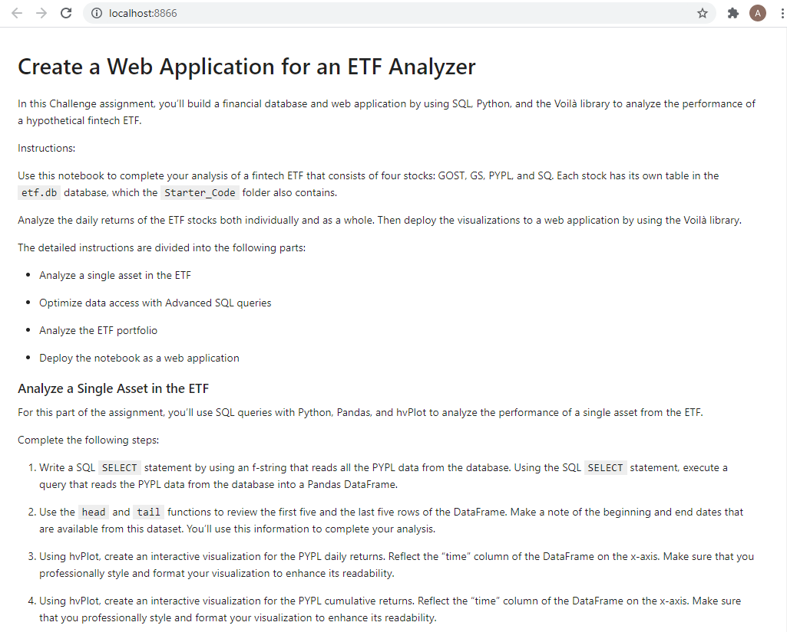
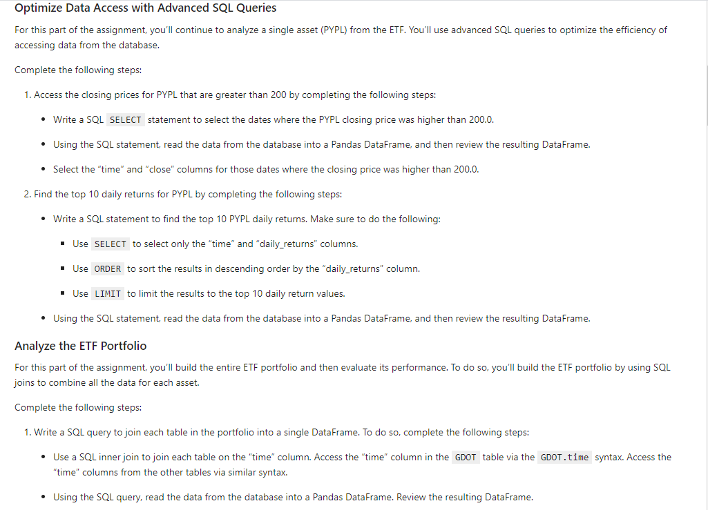
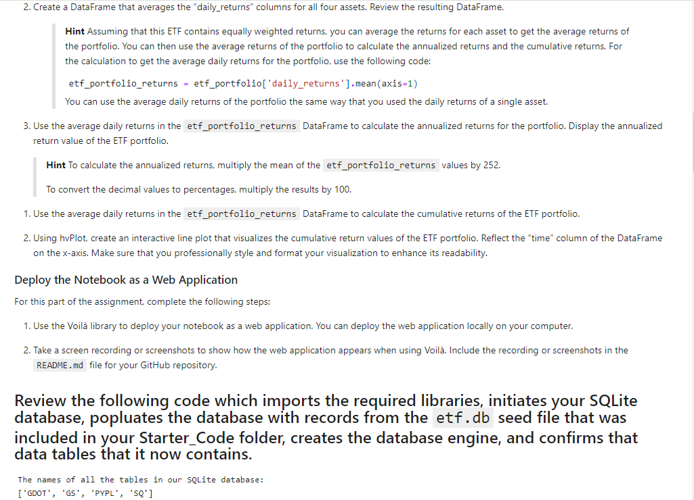
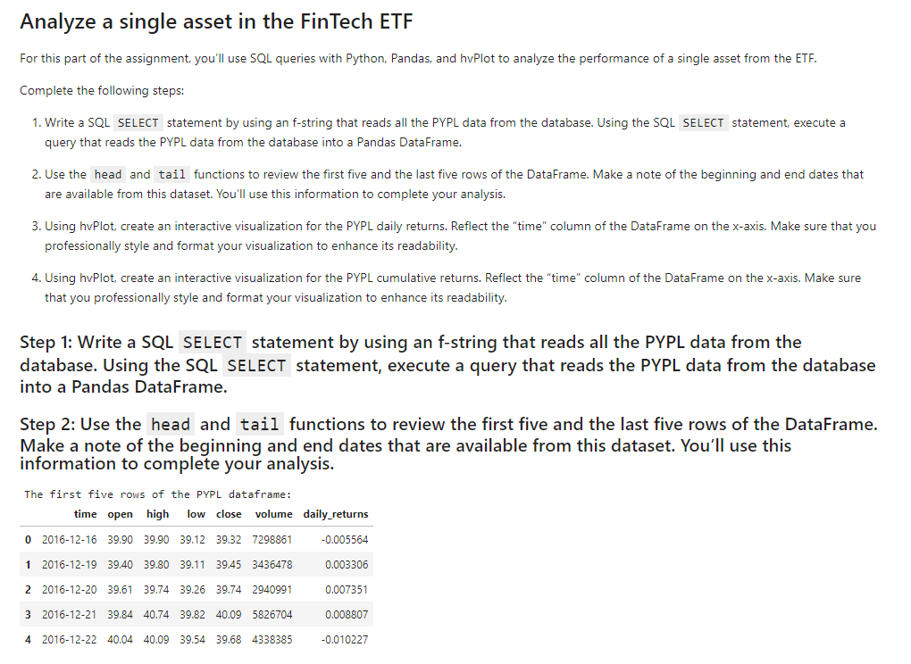
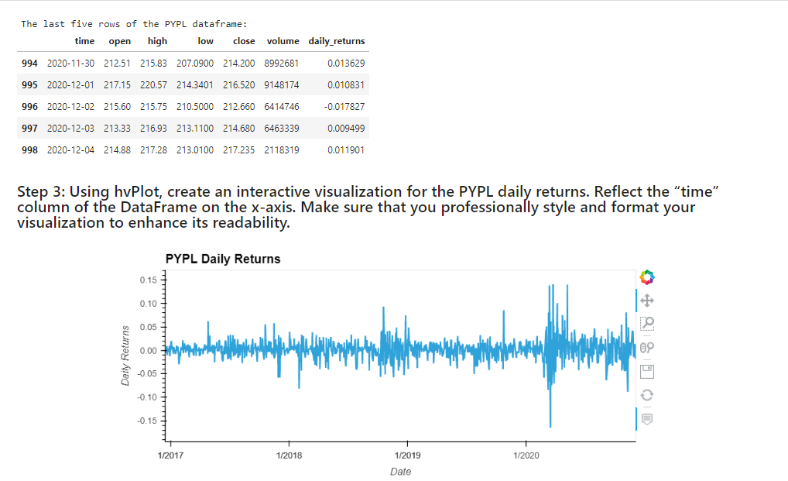
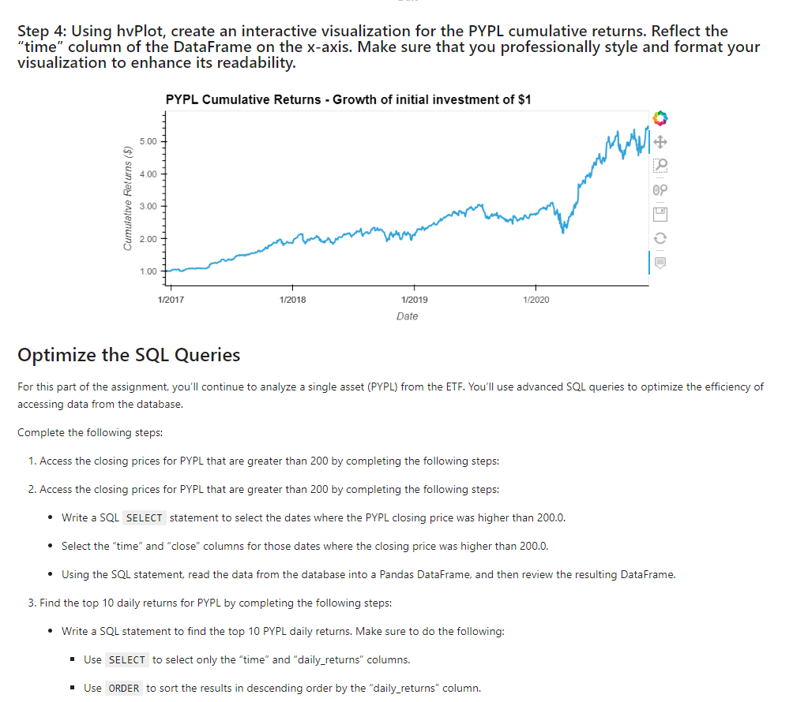

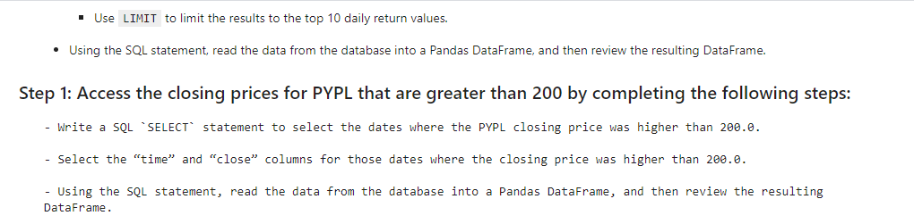
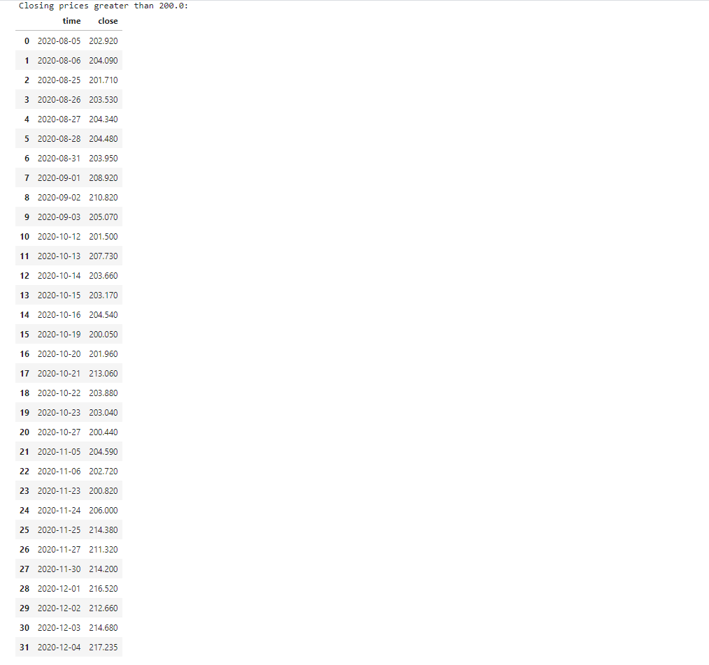
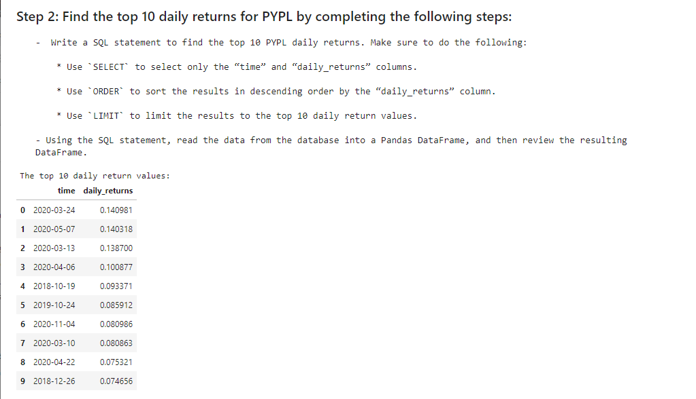
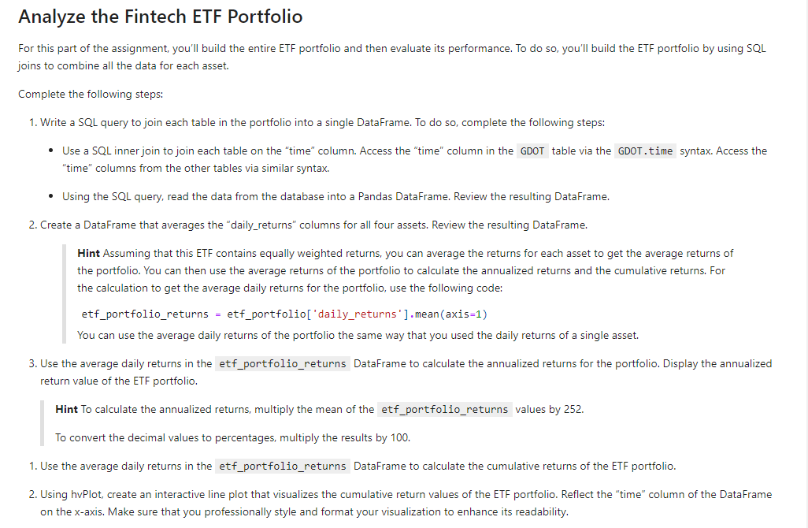
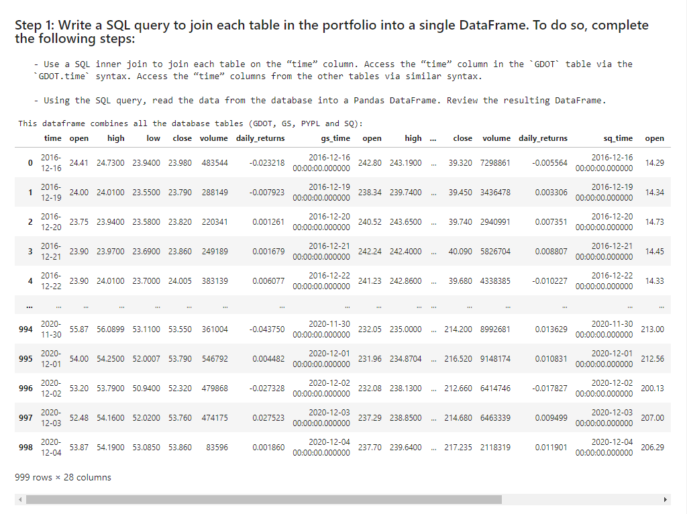
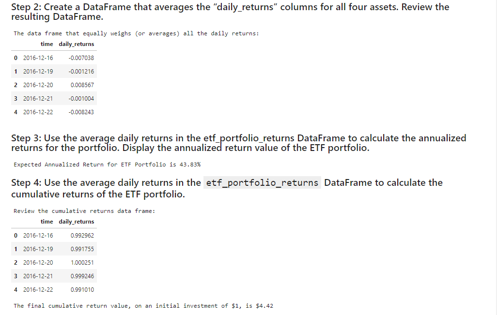
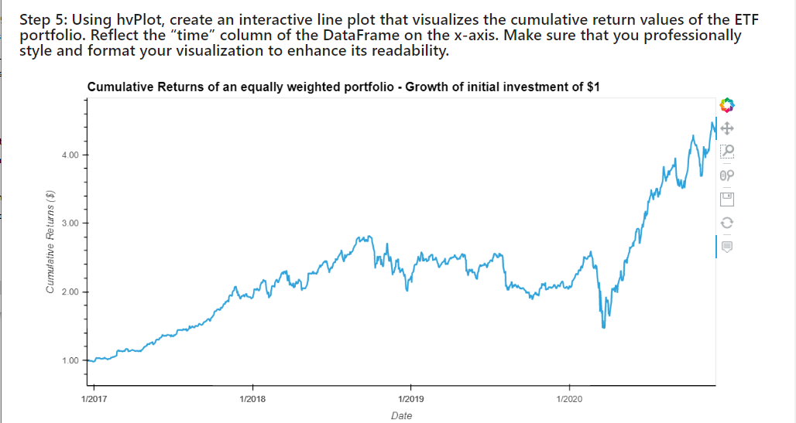

---

## Technologies

This project uses python 3.7 along with the following packages:

* [JupyterLab](https://jupyterlab.readthedocs.io/en/stable/) - Web based user interface for data analysis.

* [pandas](https://github.com/pandas-dev/pandas) - Data analysis and manipulation library.

* [voila](https://voila.readthedocs.io/en/stable/) - Voilà allows you to convert a Jupyter Notebook into an interactive dashboard that allows you to share your work with others.

* [sqlalchemy](https://pypi.org/project/SQLAlchemy/) - SQLAlchemy is the Python SQL toolkit and Object Relational Mapper.

* [hvplot](https://hvplot.holoviz.org/) - hvPlot provides a high-level plotting API built on HoloViews that provides a general and consistent API for plotting data
---

## Installation Guide

Please install the following before starting the application

```python
  pip install jupyterlab
  pip install pandas
  pip install voila
  pip install sqlalchemy
  pip install hvplot

```
In case of issues, please see the requirements.txt for a complete list of packages with versions needed to run this application

For problems with the installation:
```python
  conda deactivate
  conda install ipykernel -y
  conda create -n pyvizenv python=3.7 -y
  conda activate pyvizenv
  conda install -c conda-forge jupyterlab=2 -y
  conda install -c plotly plotly=4.13. -y
  conda install -c pyviz hvplot -y
  conda install -c conda-forge nodejs=12 -y
  conda install streamz -y
  pip install python-dotenv decorator==4.3 networkx
  conda install nb_conda_kernels ipykernel -y
  jupyter labextension install jupyterlab-plotly@4.13.0 --no-build
  jupyter labextension install @jupyter-widgets/jupyterlab-manager plotlywidget@4.13.0 --no-build
  jupyter labextension install @pyviz/jupyterlab_pyviz --no-build
  conda list plotly
  conda list hvplot
  conda list nodejs
```
---

## Usage

To use the financial planning tools, please download and open the **etf_analyzer.ipynb** in jupyter lab after executing
the following on the command line:

```python
jupyter lab
```
Jupytper Lab should open automatically in a browser. 
If it does not, please follow the instructions on the command line.

To launch voila

```python
voila etf_analyzer.ipynb
```
---

## Contributors

Sangram Singh (sangramsinghg@yahoo.com)

---

## License

MIT